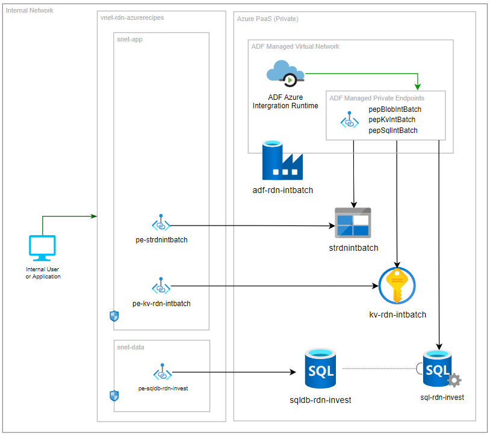

# Azure Data Factory CI/CD (Private Endpoint)

This recipe, _Azure Data Factory CI/CD (Private Endpoint)_ demostrate a few items in CI/CD automation:

- Use Azure Data Factory to run batch job using Managed Virtual Network
- Access Azure resources within private network via Private Endpoint from ADF
- Automate approval of ADF Managed Private Endpoint
- Use Key Vault to store sensitivity information

The following shows the deployment model:

For details walkthrough, please check out: [CI/CD automation in 60 minutes: Azure Data Factory CI/CD Private Endpoint](https://raideen.ca/2022/11/21/azure-data-factory-ci-cd-private-endpoint/).