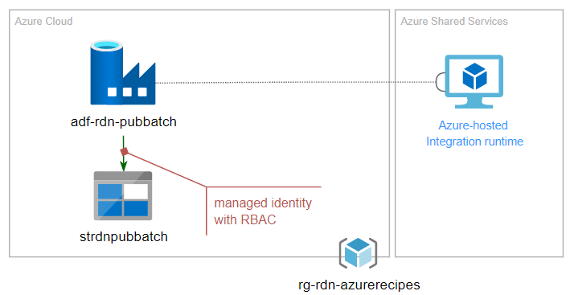

# Azure Data Factory CI/CD (Public)

This recipe, _Azure Data Factory CI/CD (Public)_ demostrate a few items in CI/CD automation:

- Use Azure Data Factory to host batch job with Schedule trigger for scheduling
- Add customized parameters per environment for Azure Data Factory
- Enable RBAC in both Storage Account with Managed Identity (MS Doc link)

The following shows the deployment model:

For details walkthrough, please check out: [CI/CD automation in 60 minutes: Public Web App with Storage Account](https://raideen.ca/2022/11/10/azure-data-factory-ci-cd-public/).