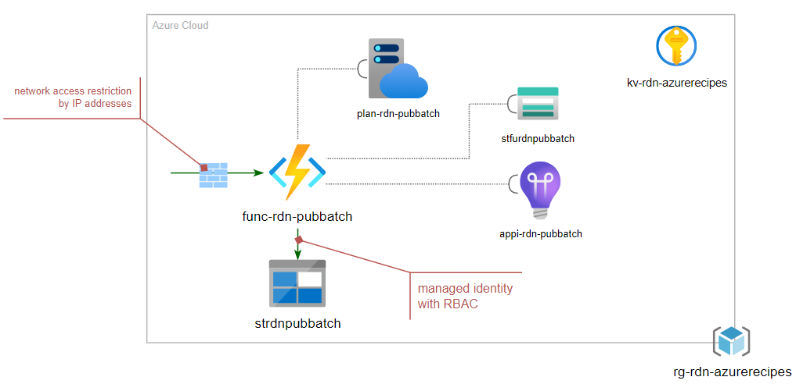

# Batch Job with Azure Functions & Storage Account

This recipe, _Batch Job with Azure Functions & Storage Account_ demostrate a few items in CI/CD automation:

- Use Azure Functions to host batch job with Timer trigger for scheduling
- Enable application monitoring with Application Insights
- Use Key Vault reference to retrieve sensitive application settings for Azure Functions
- Enable RBAC in both Storage Account with Managed Identity (MS Doc link)

The following shows the deployment model:

For details walkthrough, please check out: [CI/CD automation in 60 minutes: Public Web App with Storage Account](https://raideen.ca/2022/10/06/azure-function-batch-job-with-storage-account/).