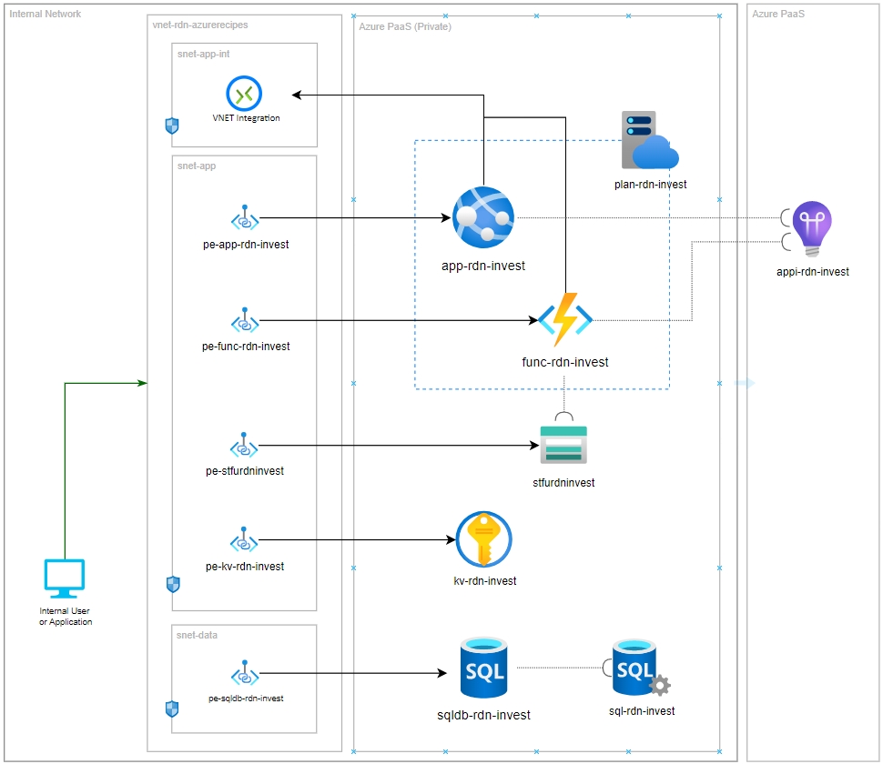

# Private Endpoint: Web & Function App with SQL Database

This recipe, _Private Endpoint: Web & Function App with SQL Database_ demostrate a few items in CI/CD automation:

- Utilize Private Endpoint to provide accessible route from private network
- Block access from public internet for Azure PaaS
- Use VNET Integration to access private network for Azure App Service
- Deploy application that is only accessible from private network

The following shows the deployment model:

For details walkthrough, please check out: [CI/CD automation in 60 minutes: Private Endpoint: Web & Function App with SQL Database](https://raideen.ca/2022/10/25/private-endpoint-web-function-app-with-sql-database).