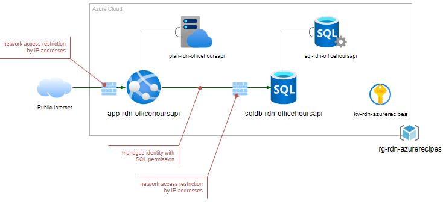

# Restricted Azure App Service with SQL Database

This introductory recipe, _Restricted Azure App Service with SQL Database_ demostrate a few items in CI/CD automation:

- Store confidential settings (e.g., login, password, etc.) in Key Vault
- Utilize IP restriction in both Web App and SQL database to limit network access
- Enable SQL permission in Azure SQL Database with Managed Identity
- Demonstrate CI/CD automation with Azure DevOps using Bicep and YAML

The following shows the deployment model:

For details walkthrough, please check out: [CI/CD automation in 60 minutes: Restricted Azure App Service with SQL databse](https://raideen.ca).