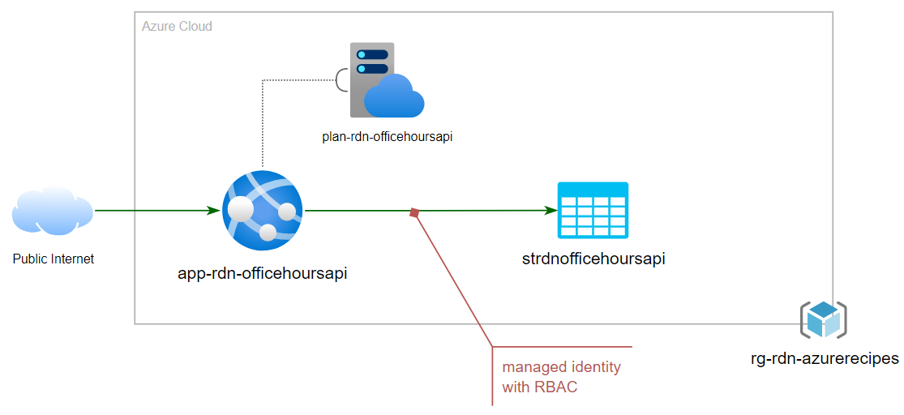

# Public Web App with Storage Account

This introductory recipe, _Public Web App with Storage Account_ demostrate a few items in CI/CD automation:

- Both Web App and Storage Account can be accessed from public internet
- Enable RBAC in Storage Account with Managed Identity 
- Create Bicep module to improve reusability
- Code sample with Azure DevOps using Bicep and YAML

The following shows the deployment model:

For details walkthrough, please check out: [CI/CD automation in 60 minutes: Public Web App with Storage Account](https://raideen.ca/2022/09/22/public-web-app-with-storage-account/).