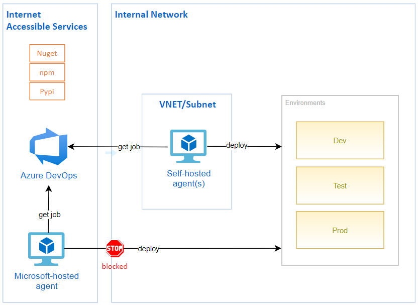

# Automation: Provision Self-Hosted Agent for Azure DevOps

For an internal application in a private network, there is no accessible paths to the application hosting platform from public internet, that's mean Azure DevOps (ADO) Microsoft-hosted agent cannot access your hosting platform for application deployment.

One of the approach is to provision a self-hosted agent:

For details walkthrough, please check out: [Automation: Provision Self-Hosted Agent for Azure DevOps](https://raideen.ca/2022/10/17/automation-provision-self-hosted-agent-for-azure-devops/).